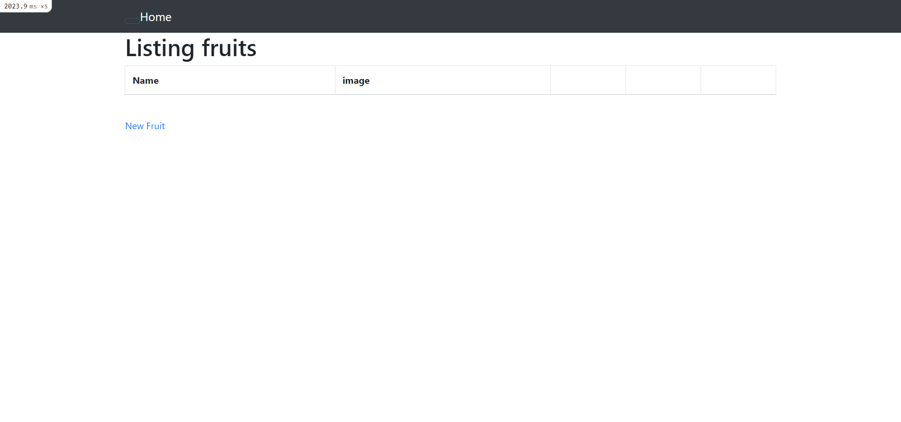
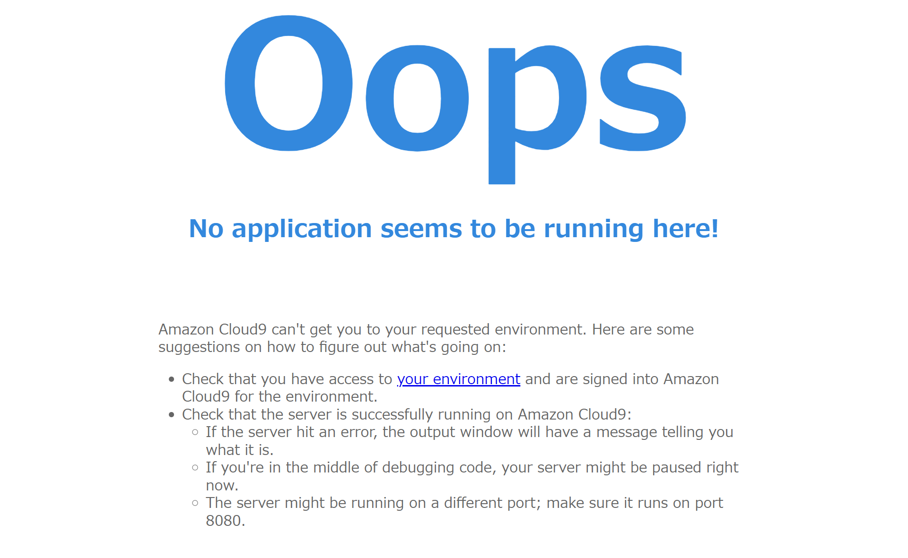
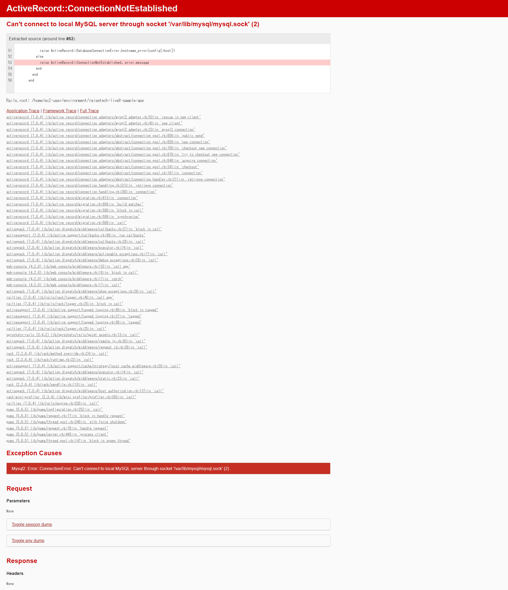

# AWSフルコースの第3回
## AP サーバーについて調べてみましょう。
- AP サーバーの名前とバージョンを確認してみましょう。
→Puma version: 5.6.5

→サンプルアプリ起動時のlog
admin:~/environment/raisetech-live8-sample-app (main) $ bin/cloud9_dev
12:05:36 web.1  | started with pid 6478
12:05:36 js.1   | started with pid 6479
12:05:36 js.1   | yarn run v1.22.19
12:05:36 js.1   | warning ../../package.json: No license field
12:05:36 js.1   | $ webpack --config ./config/webpack/webpack.config.js --watch
12:05:38 web.1  | => Booting Puma
12:05:38 web.1  | => Rails 7.0.4 application starting in development 
12:05:38 web.1  | => Run `bin/rails server --help` for more startup options
12:05:38 js.1   | Browserslist: caniuse-lite is outdated. Please run:
12:05:38 js.1   |   npx update-browserslist-db@latest
12:05:38 js.1   |   Why you should do it regularly: https://github.com/browserslist/update-db#readme
12:05:38 web.1  | Puma starting in single mode...
12:05:38 web.1  | * Puma version: 5.6.5 (ruby 3.1.2-p20) ("Birdie's Version")
12:05:38 web.1  | *  Min threads: 5
12:05:38 web.1  | *  Max threads: 5
12:05:38 web.1  | *  Environment: development
12:05:38 web.1  | *          PID: 6478
12:05:38 web.1  | * Listening on http://0.0.0.0:8080

- AP サーバーを終了させた場合、引き続きアクセスできますか？

→サンプルアプリ停止時のlog
12:08:55 web.1  | - Gracefully stopping, waiting for requests to finish
12:08:55 web.1  | === puma shutdown: 2023-07-27 12:08:55 +0000 ===
12:08:55 system | SIGINT received, starting shutdown
12:08:55 web.1  | - Goodbye!
12:08:55 web.1  | Exiting
12:08:56 system | sending SIGTERM to all processes
12:08:56 web.1  | exited with code 0
12:08:56 js.1   | terminated by SIGINT

- 結果を確認して、また AP サーバーを起動してください。
→アクセスできます。

## DB サーバーについて調べてみましょう。
- サンプルアプリケーションで使った DB サーバー（DB エンジン）の名前と、今 Cloud9 で動作しているバージョンはいくつか確認してみましょう。
→mysql  Ver 8.0.34

- DB サーバーを終了させた場合、引き続きアクセスできますか？
→サンプルアプリ停止時のlog
$ sudo service mysqld stop
Redirecting to /bin/systemctl stop mysqld.service
$ sudo service mysqld status
Redirecting to /bin/systemctl status mysqld.service
   mysqld.service - MySQL Server
   Loaded: loaded (/usr/lib/systemd/system/mysqld.service; enabled; vendor preset: disabled)
   Active: inactive (dead) since Thu 2023-07-27 12:14:01 UTC; 9s ago
     Docs: man:mysqld(8)
           http://dev.mysql.com/doc/refman/en/using-systemd.html
  Process: 4342 ExecStart=/usr/sbin/mysqld $MYSQLD_OPTS (code=exited, status=0/SUCCESS)
  Process: 4005 ExecStartPre=/usr/bin/mysqld_pre_systemd (code=exited, status=0/SUCCESS)
 Main PID: 4342 (code=exited, status=0/SUCCESS)
   Status: "Server shutdown complete"

ErrorMessage:Can't connect to local MySQL server through socket '/var/lib/mysql/mysql.sock' (2)

Jul 27 12:04:52 ip-172-31-40-101.ap-northeast-1.compute.internal systemd[1]: Starting MySQL Server...
Jul 27 12:04:56 ip-172-31-40-101.ap-northeast-1.compute.internal systemd[1]: Started MySQL Server.
Jul 27 12:13:58 ip-172-31-40-101.ap-northeast-1.compute.internal systemd[1]: Stopping MySQL Server...
Jul 27 12:14:01 ip-172-31-40-101.ap-northeast-1.compute.internal systemd[1]: Stopped MySQL Server.

- Rails の構成管理ツールの名前は何でしたか？確認してみてください。
→Bundler

## 今回の課題から学んだことを報告してください。
- Web アプリケーションについて、HTTPの基礎、AmazonLinux
- Ruby構成管理について、GemとBundlerについて
- linuxコマンドを使用した環境構築、errorの対応
