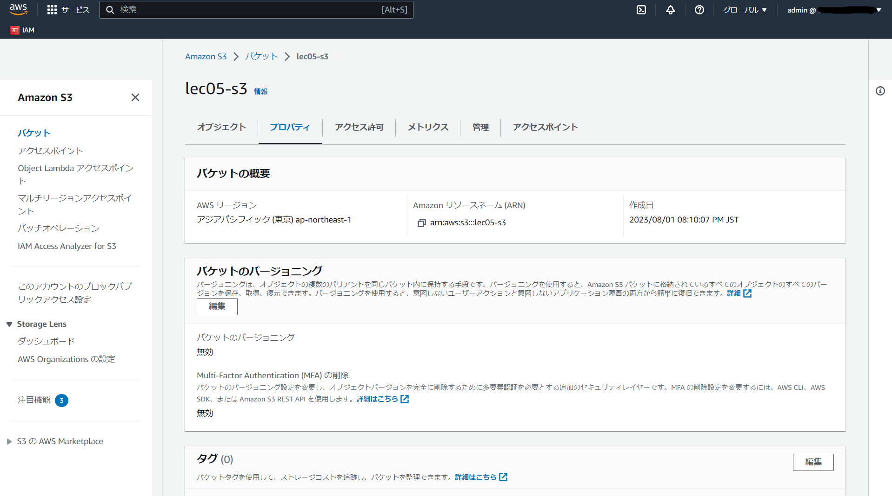

# 第5回課題

動作環境
```
ruby	3.1.2
Bundler	2.3.14
Rails	7.0.4
Node	v17.9.1
yarn	1.22.19
```

## 組み込みサーバーでデプロイする

1. サンプルアプリケーションの動作環境を構築する

```
$ sudo yum update -y
$ sudo yum install git
$ git clone https://github.com/sstephenson/rbenv.git ~/.rbenv
$ echo 'export PATH="$HOME/.rbenv/bin:$PATH"' >> ~/.bash_profile
$ echo 'eval "$(rbenv init -)"' >> ~/.bash_profile
# PATHの変更を有効にするために、シェルを再起動
$ exec $SHELL -l
# rbenvプラグインとしてruby-buildをインストール
$ git clone https://github.com/sstephenson/ruby-build.git ~/.rbenv/plugins/ruby-build
# 推奨されるパッケージをインストール
$ sudo yum install -y gcc-6 patch bzip2 openssl-devel libyaml-devel libffi-devel readline-devel zlib-devel gdbm-devel ncurses-devel
$ sudo yum -y install gcc-c++ make patch git curl zlib-devel openssl-devel ImageMagick-devel readline-devel libcurl-devel libffi-devel libicu-devel libxml2-devel libxslt-devel
# Rubyをインストール
# rbenv install 3.1.2
※インストールには時間がかかる(長いと10分程)
# rbenv global 3.1.2
# ruby -v
# Rails(7.0.4)をインストール
$ gem install rails -v 7.0.4
# nvmをインストール
$ curl -o- https://raw.githubusercontent.com/nvm-sh/nvm/v0.39.3/install.sh | bash
# nvmを有効化
$ . ~/.nvm/nvm.sh
# Node(17.9.1)をインストール
$ nvm install 17.9.1
# yarnをインストール
$ npm install --global yarn
# Bundler(2.3.14)をインストール
$ gem install bundler:2.3.14
# サンプルアプリケーションのクローン
$ sudo mkdir /var/www
$ sudo chown ec2-user:ec2-user /var/www
$ cd /var/www
$ git clone https://github.com/yuta-ushijima/raisetech-live8-sample-app.git
$ cd raisetech-live8-sample-app/config/
# RDSの設定
$ cp database.yml.sample database.yml
$ vi database.yml
default: &default
  adapter: mysql2
  encoding: utf8mb4
  pool: <%= ENV.fetch("RAILS_MAX_THREADS") { 5 } %>
  username: RDS作成時に設定したユーザー
  password: RDS作成時に設定したパスワード
  host: RDSのエンドポイント

development:
  <<: *default
  database: raisetech_live8_sample_app_development
#  socket: /tmp/mysql.sock

test:
  <<: *default
  database: raisetech_live8_sample_app_test
#  socket: /tmp/mysql.sock

# サンプルアプリケーションのREADMEに記載の手順を参考にインストール
# mariadbがある場合を想定して先に削除
$ sudo yum remove -y mysql-server
$ sudo yum remove -y mariadb*
# GPGキーの更新
$ sudo rpm --import https://repo.mysql.com/RPM-GPG-KEY-mysql-2022

# mysqlクライアントをインストール
$ curl https://dev.mysql.com/downloads/repo/yum/ | grep el7 | cut -d'(' -f2 | cut -d')' -f1
$ sudo wget https://dev.mysql.com/get/mysql80-community-release-el7-9.noarch.rpm -O /tmp/mysql.rpm
$ sudo yum localinstall -y /tmp/mysql.rpm
$ sudo yum install -y mysql-community-client
$ sudo yum install -y mysql-community-devel
$ sudo rm -f /tmp/mysql.rpm

# サンプルアプリケーションの環境構築コマンドを実行
bin/setup
# サンプルアプリケーションの起動
bin/dev
```

2. サンプルアプリケーションの動作確認


## Nginx + Unicornでデプロイできるようにする


## ELBを追加する


## S3を追加する



## 今回の課題から学んだこと
- VPC、サブネット構築、EC2 インスタンスの作成(AL2、AL2023)
