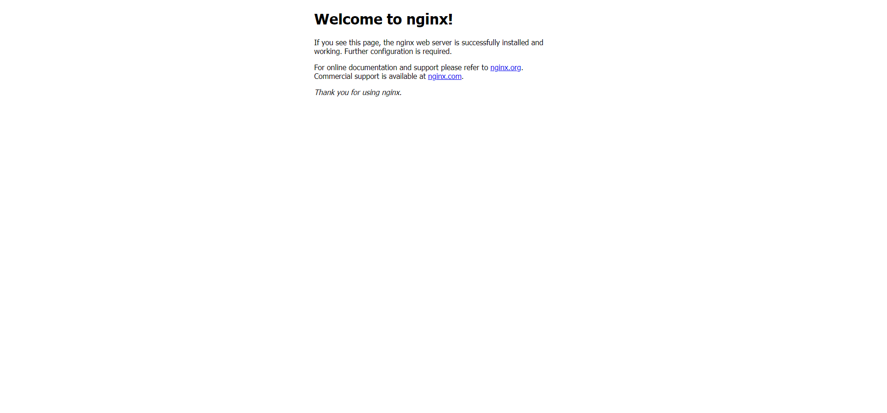

# 第5回課題

サンプルアプリケーションの動作環境
```
ruby	3.1.2
Bundler	2.3.14
Rails	7.0.4
Node	v17.9.1
yarn	1.22.19
```

## 組み込みサーバーでデプロイする

1. サンプルアプリケーションの動作環境を構築する

```
$ sudo yum update -y
$ sudo yum install git
$ git clone https://github.com/sstephenson/rbenv.git ~/.rbenv
$ echo 'export PATH="$HOME/.rbenv/bin:$PATH"' >> ~/.bash_profile
$ echo 'eval "$(rbenv init -)"' >> ~/.bash_profile
# PATHの変更を有効にするために、シェルを再起動
$ exec $SHELL -l
# rbenvプラグインとしてruby-buildをインストール
$ git clone https://github.com/sstephenson/ruby-build.git ~/.rbenv/plugins/ruby-build
# 推奨されるパッケージをインストール
$ sudo yum install -y gcc-6 patch bzip2 openssl-devel libyaml-devel libffi-devel readline-devel zlib-devel gdbm-devel ncurses-devel
$ sudo yum -y install gcc-c++ make patch git curl zlib-devel openssl-devel ImageMagick-devel readline-devel libcurl-devel libffi-devel libicu-devel libxml2-devel libxslt-devel
# Rubyをインストール
# rbenv install 3.1.2
※インストールには時間がかかる(長いと10分程)
# rbenv global 3.1.2
# ruby -v
# Rails(7.0.4)をインストール
$ gem install rails -v 7.0.4
# nvmをインストール
$ curl -o- https://raw.githubusercontent.com/nvm-sh/nvm/v0.39.3/install.sh | bash
# nvmを有効化
$ . ~/.nvm/nvm.sh
# Node(17.9.1)をインストール
$ nvm install 17.9.1
# yarnをインストール
$ npm install --global yarn
# Bundler(2.3.14)をインストール
$ gem install bundler:2.3.14

# サンプルアプリケーションのクローン
$ sudo mkdir /var/www
$ sudo chown ec2-user:ec2-user /var/www
$ cd /var/www
$ git clone https://github.com/yuta-ushijima/raisetech-live8-sample-app.git
$ cd raisetech-live8-sample-app/config/

# RDSの設定
$ cp database.yml.sample database.yml
$ vi database.yml
default: &default
  adapter: mysql2
  encoding: utf8mb4
  pool: <%= ENV.fetch("RAILS_MAX_THREADS") { 5 } %>
  username: RDS作成時に設定したユーザー
  password: RDS作成時に設定したパスワード
  host: RDSのエンドポイント

development:
  <<: *default
  database: raisetech_live8_sample_app_development
#  socket: /tmp/mysql.sock

test:
  <<: *default
  database: raisetech_live8_sample_app_test
#  socket: /tmp/mysql.sock

# サンプルアプリケーションのREADMEに記載の手順を参考にインストール
# mariadbがある場合を想定して先に削除
$ sudo yum remove -y mysql-server
$ sudo yum remove -y mariadb*
# GPGキーの更新
$ sudo rpm --import https://repo.mysql.com/RPM-GPG-KEY-mysql-2022

# mysqlクライアントをインストール
$ curl https://dev.mysql.com/downloads/repo/yum/ | grep el7 | cut -d'(' -f2 | cut -d')' -f1
$ sudo wget https://dev.mysql.com/get/mysql80-community-release-el7-9.noarch.rpm -O /tmp/mysql.rpm
$ sudo yum localinstall -y /tmp/mysql.rpm
$ sudo yum install -y mysql-community-client
$ sudo yum install -y mysql-community-devel
$ sudo rm -f /tmp/mysql.rpm

# サンプルアプリケーションの環境構築コマンドを実行
bin/setup
# サンプルアプリケーションの起動
bin/dev
# アプリ起動後にDBが作成されていない場合は、画面からcreate db、migrateを行う
```

2. サンプルアプリケーションの動作確認


## Nginx + Unicornでデプロイする

1. 環境構築
```
# Nginxをインストール
$ sudo amazon-linux-extras install -y nginx1
$ sudo systemctl start nginx
$ sudo systemctl stop nginx

# Railsの設定を変更する
$ cd /var/www/raisetech-live8-sample-app/config/
# pathを変更する
$ vim unicorn.rb
listen '/var/www/raisetech-live8-sample-app/unicorn.sock'
pid    '/var/www/raisetech-live8-sample-app/unicorn.pid

$ cd /etc/nginx/conf.d
# 設定ファイルの作成
$ sudo vim rails.conf
upstream unicorn {
  server unix:/var/www/raisetech-live8-sample-app/unicorn.sock;
}

server {
  listen 80;
  # server_name _;
  root /var/www/raisetech-live8-sample-app/public;

  location @unicorn {
    proxy_set_header X-Forwarded-For $proxy_add_x_forwarded_for;
    proxy_set_header Host $http_host;
    proxy_redirect off;
    proxy_pass http://unicorn;
  }

  try_files $uri/index.html $uri @unicorn;
  error_page 404 /404.html;
  error_page 422 /422.html;
  error_page 500 502 503 504 /500.html;
}

# Nginx + Unicornを起動
$ sudo systemctl start nginx
$ bundle exec unicorn_rails -c config/unicorn.rb -E development -D
```

2. 動作確認



## ELBを追加する
1. ELB(ALB)のDNS名でアクセスできるか確認する
```
# Nginxの再起動
$ sudo systemctl stop nginx
$ sudo systemctl start nginx

# Unicornの再起動
$ ps -ef | grep unicorn | grep -v grep
# PIDを設定する
$ kill -9 ****
$ cd /var/www/raisetech-live8-sample-app
$ bundle exec unicorn_rails -c config/unicorn.rb -E development -D
```

2. 動作確認
URLは、「http://ALBのDNS名/fruits」です。


## アプリからアップロードした画像保存用にS3を追加する
1. 準備
```
アップロードした画像保存用に使用
S3用のIAMユーザーを作成する。ポリシーは、AmazonS3FullAccessを設定する。
アクセスキーとシークレットキーをローカルに保存する。
```


2. 環境構築
```
# Railsの設定を変更する。サンプルアプリケーションのGemfileにaws-sdk-s3が記述されていることを確認
# aws-sdk-s3インストール
# Gemfileでgem "aws-sdk-s3", require: falseを確認
$ vi Gemfile
$ bundle install

# 設定ファイルがあるディレクトリに移動
$ cd /var/www/raisetech-live8-sample-app/config/credentials/
# 設定ファイルの削除
$ rm development.yml.enc
# 設定ファイルの作成
$ EDITOR=vim rails credentials:edit --environment development
aws:
  access_key_id: 作成したアクセスキー
  secret_access_key: 作成したシークレットアクセスキー
  active_storage_bucket_name: 作成したバケットの名前

# 'development.rb'があるディレクトリに移動
$ cd /var/www/raisetech-live8-sample-app/config/environments
# 'development.rb'を編集
$ vim development.rb
config.active_storage.service = :amazon

# Nginxの再起動
$ sudo systemctl stop nginx
$ sudo systemctl start nginx

# Unicornの再起動
$ ps -ef | grep unicorn | grep -v grep
$ kill -9 上記コマンドで確認したプロセス
$ bundle exec unicorn_rails -c config/unicorn.rb -E development -D
```

3. 動作確認


## 今回の課題から学んだこと
- rubyコマンド、サーバー構築(Nginx/Unicorn)、
- 複数サービスに関わるセキュリティグループの設定、ELB作成と接続
- S3作成と設定、RDS接続、構成図の作成方法
