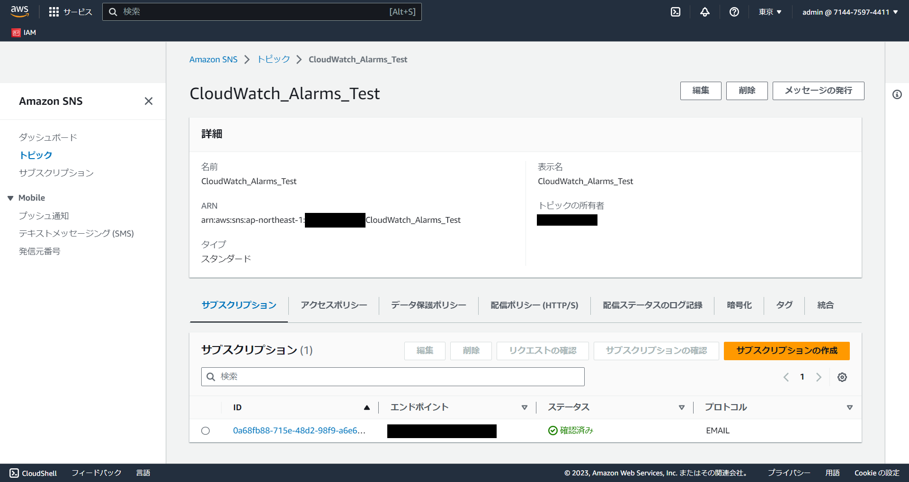
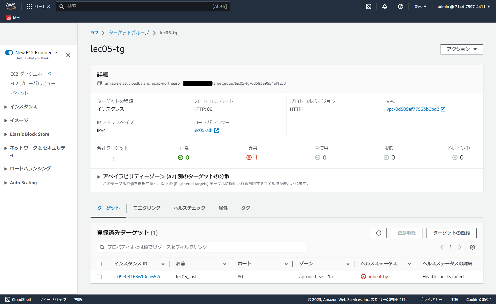
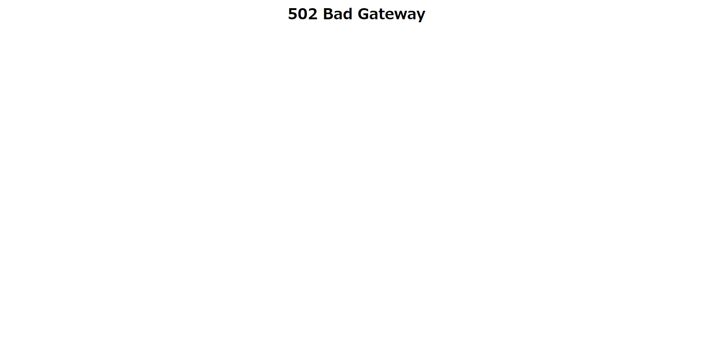
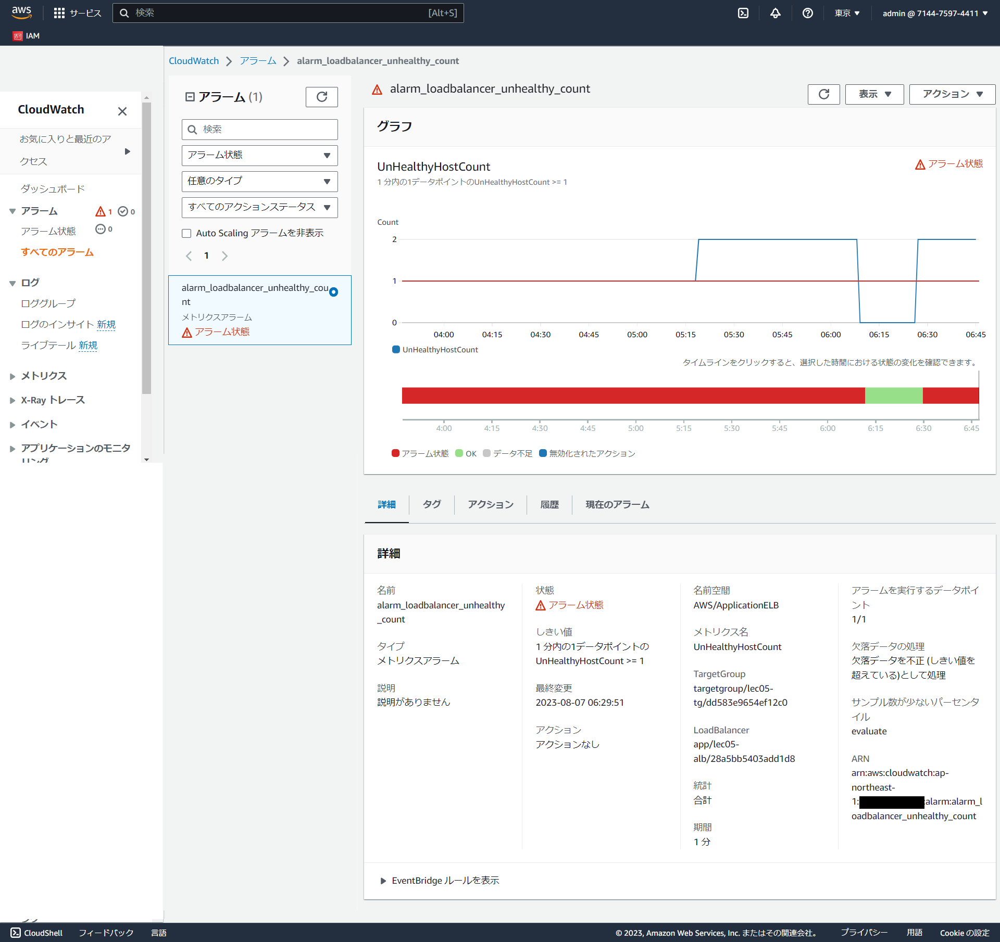
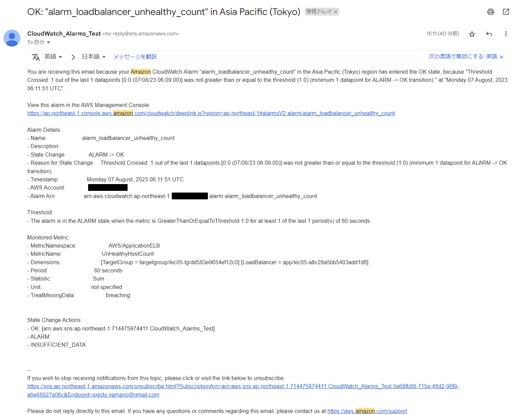
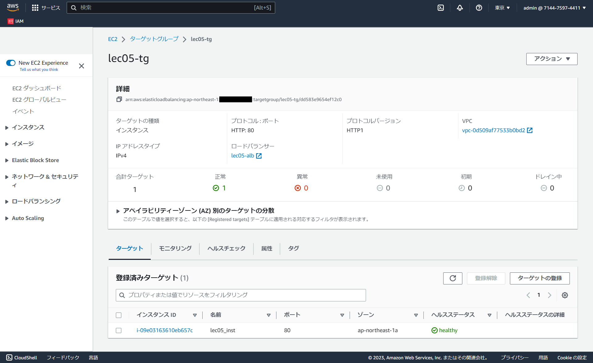
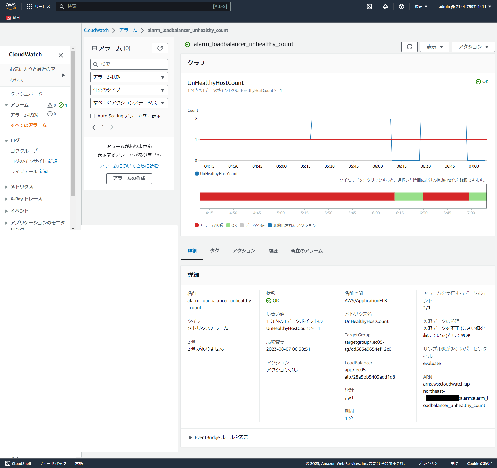
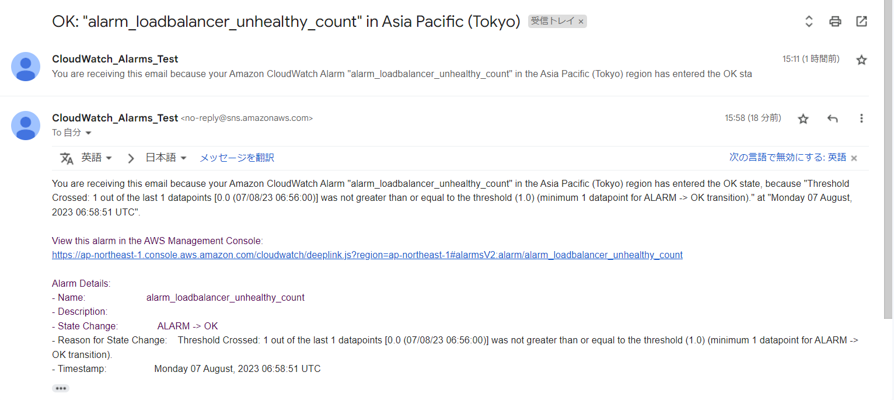
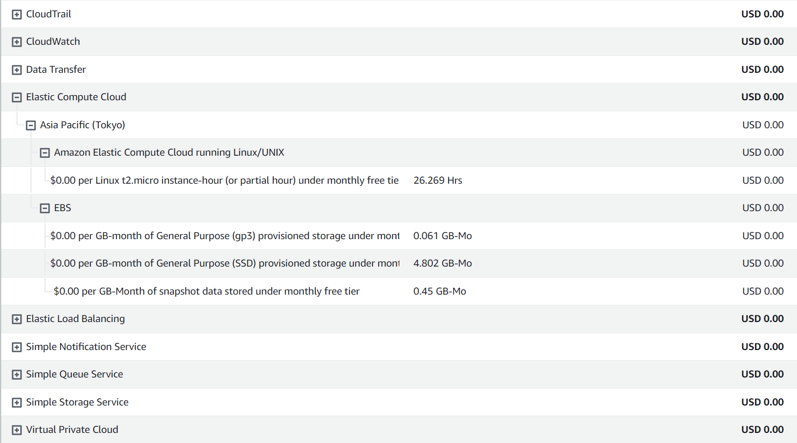

# 第6回課題

## CloudWatchアラームを使って、ALBのアラームを設定し、メール通知する
- ALBのターゲットグループが「正常」「異常」を監視するアラームを設定
- SNSでメールを送信するアクションを設定

## サンプルアプリケーションが停止している状態で動作を確認する
- Nginxを停止
- ターゲットグループのヘルスステータスが「異常」になっていることを確認

- CloudWatchで「アラーム状態」になっていることを確認

- SNSで指定したメールアドレス宛にメールが届いていることを確認

## サンプルアプリケーションが起動している状態で動作を確認する
- Nginxを起動
- ターゲットグループのヘルスステータスが「正常」になっていることを確認

- CloudWatchで「OK」になっていることを確認

- SNSで指定したメールアドレス宛にメールが届いていることを確認

## AWS利用料の見積を作成する
- 今日までに作成したリソースの内容の見積
[My Estimate](https://calculator.aws/#/estimate?id=710ee6bdf5fee83825cee73e8732393281db6ac3)

## マネジメントコンソールから、現在の利用料を確認する
- 先月の請求情報から、EC2の料金がいくらか、無料利用枠で収まっているか確認

## 今回の課題から学んだことを報告する
- AWS でのロギング方法と監視・通知方法を学べた。
- コスト管理で無料枠の条件を改めて確認できたので今後のコスト管理活かせそうです。
