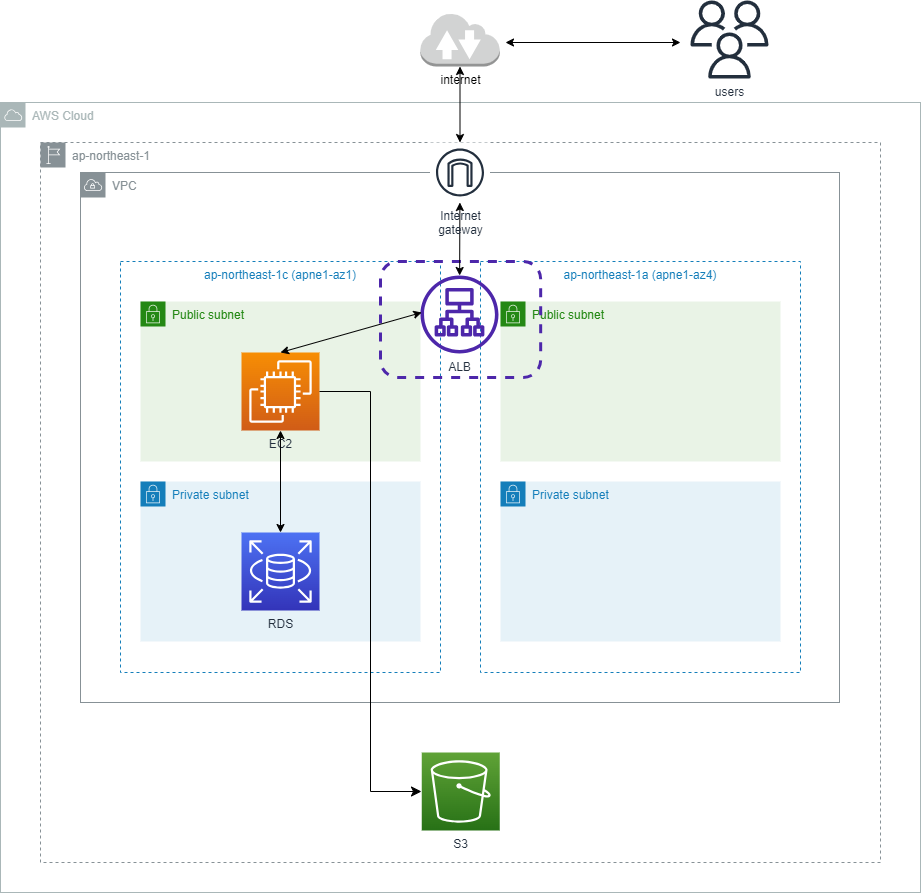

# 第7回課題

## 第5回の構成図のセキュリティ上の問題点と改善策や検討内容

### 負荷 
- EC2を冗長化していないため大量のアクセスがあった場合に対応できない。 
→今回無料枠で構築しているが本番運用を想定した場合は、冗長化構成で可用性を高めるためマルチAZ構成にしてEC2を配置して負荷を分散させる。 

### 認証 
- IAMユーザー(admin)に管理者権限がすべて（AdministratorAccess）が付与されている 
→最小権限の法則に則って不要な権限は許可しない方が望ましい。 

### 脆弱性 
- HTTP通信のため暗号化されていない 
→ACMで証明書を発行するしてHTTPS通信を行う。またはHTTPを閉じる。 

- 攻撃の遮断 
→全ての攻撃遮断できるわけではないが、WAFを検討してもよい。その際のルールは、AWSManagedRulesCommonRuleSetを推奨。 

- AWSの設定情報について 
→小規模ではあるがAWSの設定情報を検索して、脆弱な部分を指摘するSecurity Hubを検討してもよい。 

- Rubyのver.によっての脆弱性 
→ver.によってはHTTPレスポンスヘッダーや本文に無効な属性が挿入される可能性があるためAWSでもマネージドサービスを使って攻撃から防護する事やDependabotの導入を検討する。 

- サンプルアプリケーションのコードについて 
→将来的に改修して利用する場合などは、導入にはコストを考慮する必要があるがバグなどの対策としてCodeGuru Reviewerを使用すればコードをスキャンし、改善を提案してくれる。 

## 感想
- セキュリティを意識するとトレードオフの関係にある要素が発生するため、システムのバランスやコストを考慮する必要がある。
- 今回の講義で紹介されたセキュリティサービスは代表的なものなので、セキュリティを意識する事によりシステムをより深く理解するきっかけとしたい。
