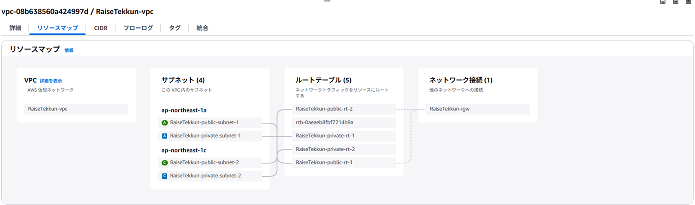
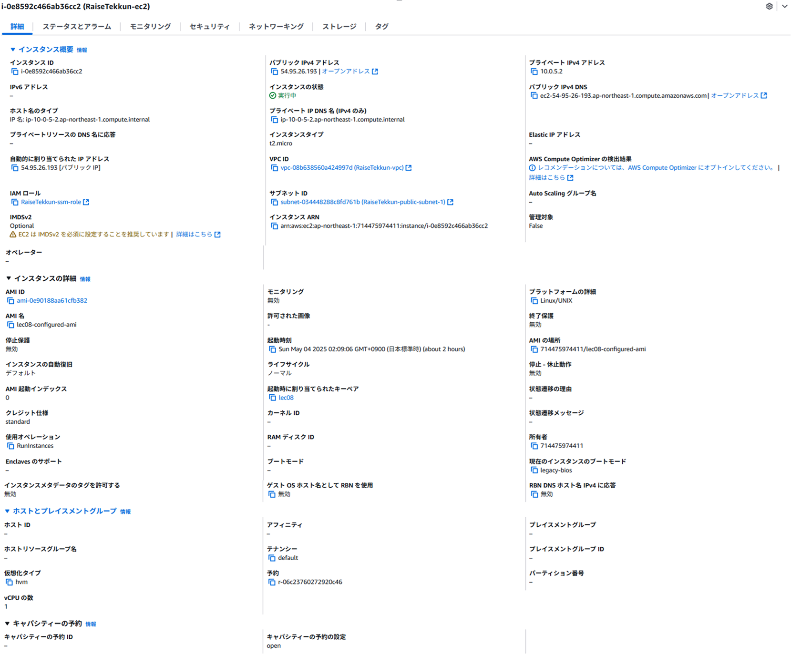
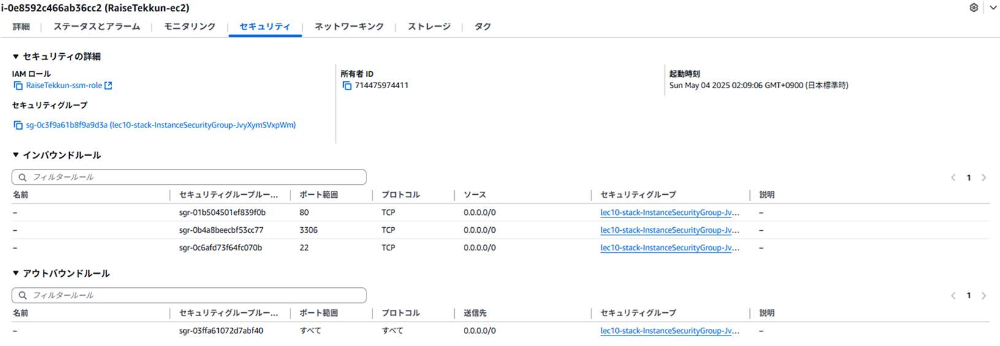
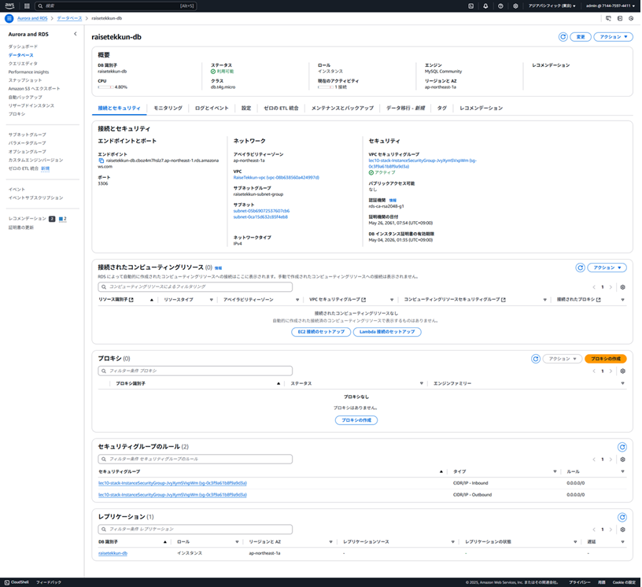
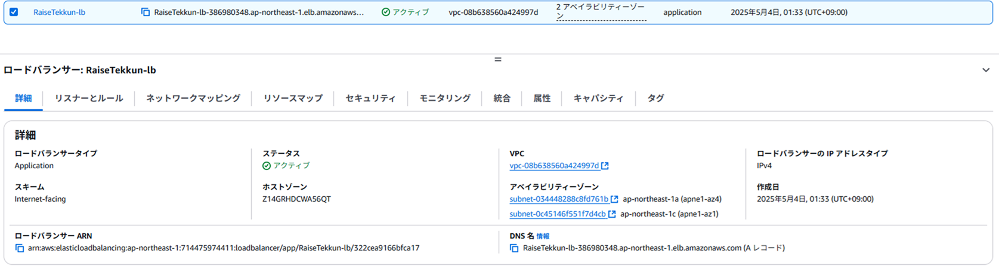
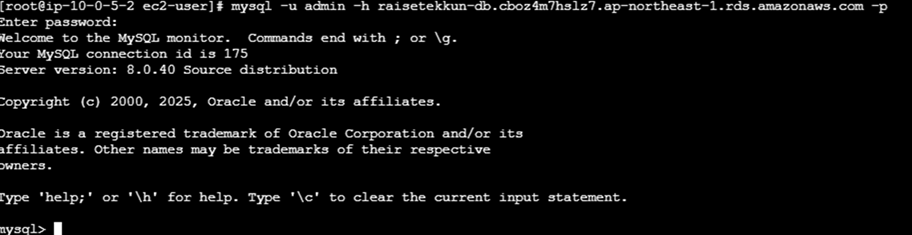

# 第１０回課題
* ※第5回の課題で作成したインフラ環境をCloudFormation（以降CFnと記載）で構築する。

## CFnに使用したyamlファイル
* [template.yaml](template.yaml)

## CFnで作成したリソース
* VPC

* EC2

  - EC2のインバウンド
  

* RDS

* ELB

## CFnで作成したリソースに接続できるか確認
* CFnで作成したリソース間の接続(EC2→RDS)

