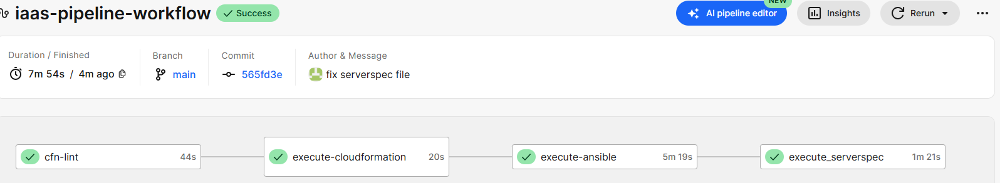
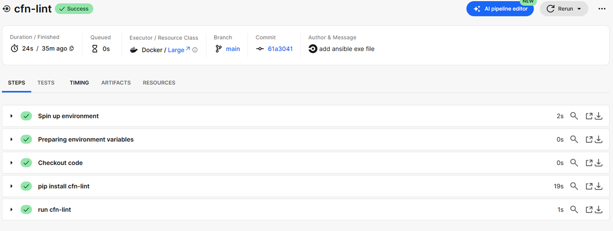
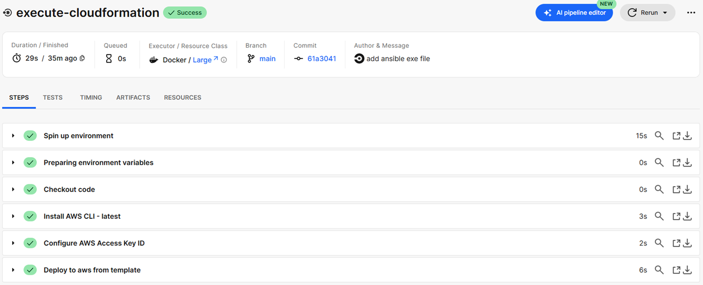
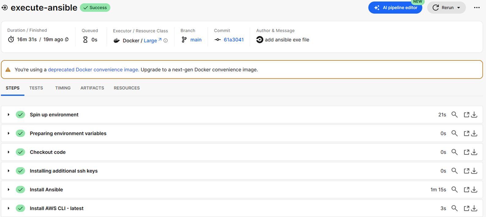
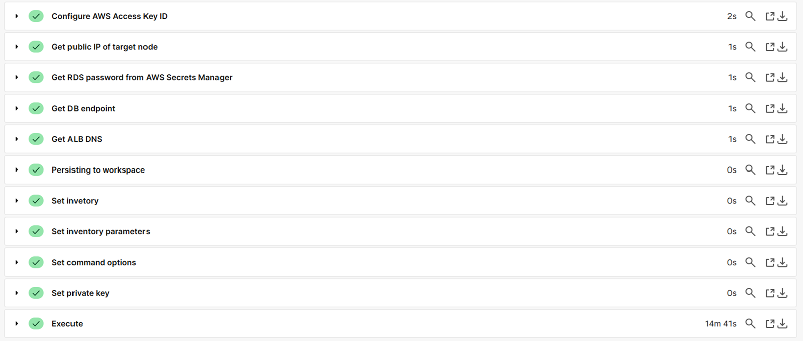
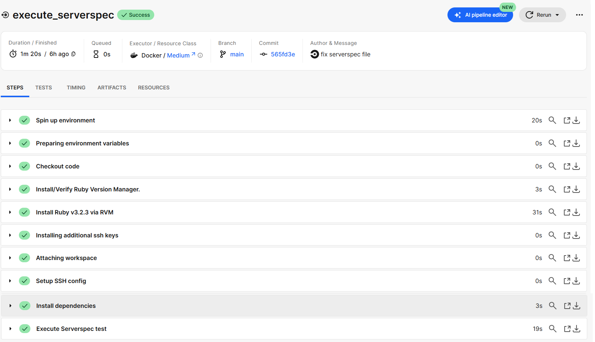
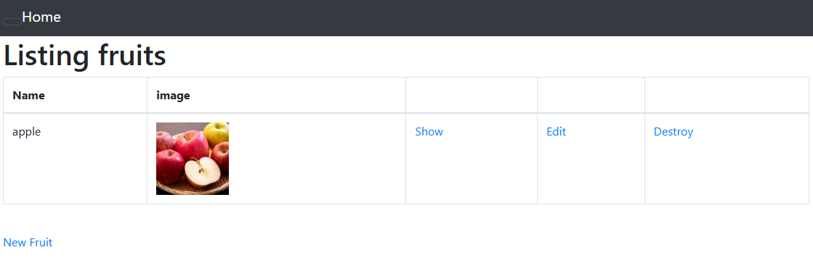
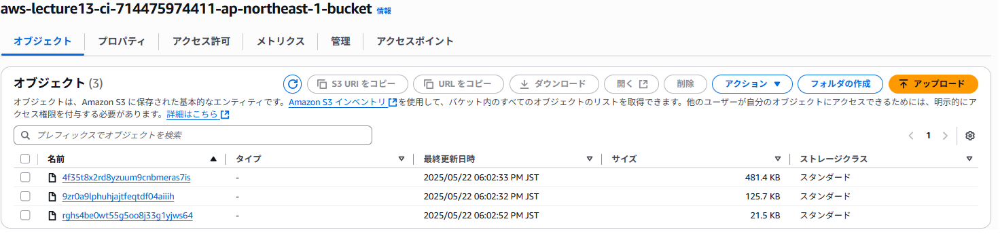
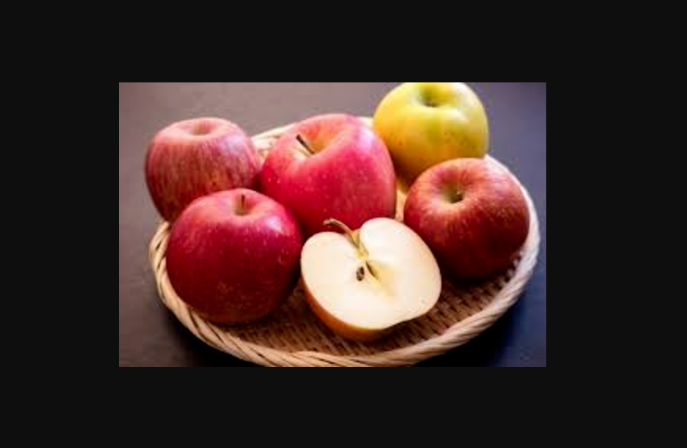

## 第 13 回課題

CirclrCI のサンプルに ServerSpec と Ansible の処理を追加。  
[CircleCI 実行用リポジトリ](https://github.com/devac-tech/lec13_ansible)

### 実施内容

以下を CircleCI で自動実行するよう設定。

1. cfn-lint で CloudFormation の構文チェック
2. CloudFormation で AWS リソースを作成
3. Ansible でサンプルアプリケーションが EC2 上で動作するようセットアップ
4. ServerSpec で EC2 サーバのテスト

### CircleCI の実行結果

全体

cfn-lint

CloudFormation 実行

Ansible 実行

ServerSpec 実行

### アプリケーション動作

ALB の DNS 名にアクセスし、アプリケーションが使用できることを確認

画像が S3 に保存されていることを確認

